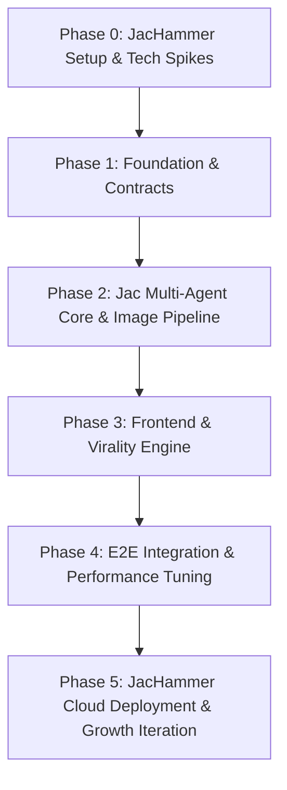

# App Development Strategy & Implementation Roadmap

## 1. Executive Summary

This document outlines the step-by-step strategy for executing the **Hyper-Personalized Personality & Caricature Avatar Generator** web application using **JacHammer** ([https://jachammer.ai/](https://jachammer.ai/)) as the core development platform and cloud agent server, progressing from scope finalization through architecture, multi-agent development, frontend integration, virality optimization, and deployment.

---

## 2. Strategic Phases & Workflow

---

## Phase 0: JacHammer Workspace Setup & Tech Spikes (Current Phase)
**Goal**: Lock in requirements, configure JacHammer project workspace, and validate high-risk dependencies before coding.

1. **JacHammer Workspace Setup ([jachammer.ai](https://jachammer.ai/))**:
   - Initialize project environment on JacHammer platform.
   - Configure Jac keys, BYOM / LLM routing endpoints, and cloud persistence database.
2. **Scope & Spec Lock**:
   - Finalized `PRD.md` and `SYSTEM_DESIGN.md` payload contracts.
   - Defined exact schemas for `UserSessionNode`, `QuestionNode`, `TraitArchetypeNode`, `DeepAnalysisNode`, and `AvatarArtifactNode`.
   - Integrated 28-question baseline dataset (`mbti_questions_28.json`) and scoring calculator (`mbti_calculator.py`).
3. **Tech Spike — Avatar Generation & SVG Fallback Adapter**:
   - Test image generation endpoints (Replicate / Fal.ai / FLUX / InstantID).
   - Verify 10-second timeout circuit breaker and test SVG vector fallback rendering.

---

## Phase 1: Architecture & Data Contracts
**Goal**: Establish solid contracts between JacHammer backend cloud and Next.js frontend client.

1. **Interface Specifications (JacHammer REST API)**:
   - `POST /api/session/init`: Initializes session & returns Q1.
   - `POST /api/quiz/answer`: Submits choice/freeform text & returns Q2–Q12.
   - `GET /api/quiz/result/[sessionId]`: Fetches permalink payload (archetype title, radar data, avatar image URL, fallback status).
   - `POST /api/avatar/re-roll`: Re-rolls avatar with style preset.
2. **Shared Data Models / Types**:
   - Create TypeScript interfaces mirroring Jac structs (`LikenessData`, `TraitResult`, `DeepAnalysisPayload`, `AvatarPromptStack`).
3. **Base Repository Setup**:
   - Directory structure: `backend/jac/` for Jac nodes and walkers; `frontend/` for Next.js app; `docs/` for specs.

---

## Phase 2: Core Jac Multi-Agent & Image Pipeline (Backend Engine)
**Goal**: Build the stateful graph execution backend and image generation adapter in Jac.

1. **Workstream 2.1 — Jac Stateful Graph & Node Model**:
   - Implement core graph nodes (`UserSessionNode`, `QuestionNode`, `AnswerNode`, `TraitArchetypeNode`, `DeepAnalysisNode`, `AvatarArtifactNode`).
2. **Workstream 2.2 — Multi-Agent Walker Development**:
   - **`IntakeWalker` (Agent 1)**: Traversal with 28 situational questions and input moderation guardrails.
   - **`TraitWalker` (Agent 2)**: Deterministic MBTI calculation + LLM synthesis of unhinged title, badge highlights, and deep analysis payload.
   - **`AvatarWalker` (Agent 3)**: 3-layer prompt synthesis (MBTI character base + specialized trait overlay + likeness payload).
3. **Workstream 2.3 — Image Adapter & Circuit Breaker**:
   - Implement pluggable adapter module for Replicate / Fal.ai with 10s timeout, retry logic, watermark application, and SVG vector fallback.

---

## Phase 3: Client Application & Virality Engine (Frontend)
**Goal**: Deliver a premium, glassmorphic client web application focused on engagement and instant social sharing.

1. **Workstream 3.1 — Core User Journey (`/` & `/test`)**:
   - **Landing Page (`/`)**: Hero section, dynamic avatar preview carousel, CTA, privacy notice.
   - **Quiz Engine (`/test`)**: Smooth step transitions, progress bar, choice selector, free-form text input (max 280 chars), client state persistence (`localStorage`).
   - **Likeness Step**: Dual toggle between Photo Upload (with crop/preview) and Manual Attribute Selectors (skin tone, hair style/color, accessories).
2. **Workstream 3.2 — Results & Archetype Hub (`/result/[sessionId]`)**:
   - **Public Permalinks**: Server-rendered result pages accessible directly via shared URL.
   - **Primary Poster**: Caricaturized avatar display (or SVG fallback), unhinged title, top 3-4 trait badges.
   - **Deep Analysis View**: Expandable drawer with 15-model matrix radar chart, strengths/flaws, and roasted commentary.
3. **Workstream 3.3 — Virality & Sharing Suite**:
   - Canvas/SVG renderer for $9:16$ vertical Instagram/TikTok Story cards with avatar, title, and referral QR code.
   - Dynamic OpenGraph (OG) image endpoint for preview cards on iMessage, Twitter/X, and WhatsApp.
   - Native Web Share API integration with custom referral link parameter.

---

## Phase 4: Integration, Hardening & Testing
**Goal**: Ensure end-to-end reliability, sub-second client responsiveness, and fault tolerance.

1. **End-to-End Flow Verification**:
   - Comprehensive testing from landing page through quiz intake, walker processing, avatar rendering, and share card export.
2. **Performance Optimization**:
   - Target NFR checks: Quiz steps < 200ms transition; `TraitWalker` synthesis < 3s; Avatar rendering < 10s with dynamic interactive loader; SVG fallback trigger at 10.1s.
3. **Resilience & Fallbacks**:
   - Verification of SVG vector fallback when image generation APIs time out.
   - Sanitization of user free-form inputs for LLM prompt safety.

---

## Phase 5: Deployment on JacHammer Cloud
**Goal**: Deploy Jac backend to JacHammer cloud platform and launch production application.

1. **JacHammer Deployment**:
   - Deploy Jac multi-agent backend graph and persistence database to **JacHammer Cloud** ([jachammer.ai](https://jachammer.ai/)).
   - Deploy Next.js frontend to Vercel/Netlify connected to JacHammer cloud endpoints.
2. **Growth Analytics & Monetization Hooks**:
   - Event tracking for quiz completion rate, share card downloads, and referral link clicks.
   - UI placeholders for premium monetization (HD watermark removal, style theme packs, group compatibility matrix).

---

## 3. Recommended Execution Order & Team Roles

| Step | Scope | Responsible Component | Key Deliverable |
| :--- | :--- | :--- | :--- |
| **Step 1** | JacHammer Spike & Contracts | JacHammer & Specs | Environment keys, API Contracts & SVG Fallback Spike |
| **Step 2** | Backend Nodes & Walkers | `backend/jac/` | Stateful graph, Agents 1 & 2 with deterministic calculator |
| **Step 3** | Image Gen & Fallback Adapter | `backend/services/` | 3-Layer avatar generator + 10s SVG circuit breaker |
| **Step 4** | Frontend App & Permalinks | `frontend/` | UI flow (`/`, `/test`, `/result/[sessionId]`) |
| **Step 5** | Virality Engine | Frontend & Edge | 9:16 story cards & dynamic OG links |
| **Step 6** | JacHammer Cloud Release | JacHammer & Vercel | Production release & metrics |
