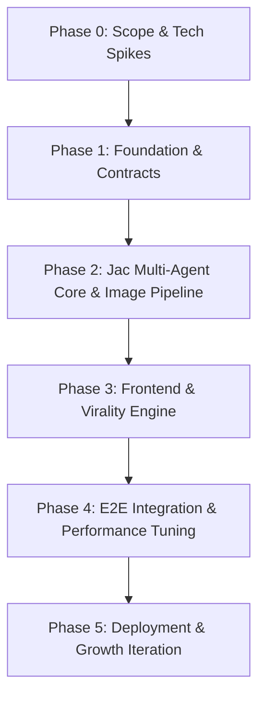

# App Development Strategy & Implementation Roadmap

## 1. Executive Summary

This document outlines the step-by-step strategy for executing the **Hyper-Personalized Personality & Caricature Avatar Generator** web application, progressing from scope finalization through architecture, multi-agent development, frontend integration, virality optimization, and launch.

---

## 2. Strategic Phases & Workflow

---

## Phase 0: Scope Finalization & Tech Spikes (Current Phase)
**Goal**: Lock in requirements, schemas, and validate high-risk dependencies before coding.

1. **Scope & Spec Lock**:
   - Finalize `PRD.md` and `SYSTEM_DESIGN.md` payload contracts.
   - Define exact schema structures for `UserSessionNode`, `QuestionNode`, `TraitArchetypeNode`, and `AvatarArtifactNode`.
2. **Tech Spike 1 — Jac CLI & Server Setup**:
   - Verify local Jac execution (`jac run`, `jac serve` or API gateway integration).
   - Define node-walker event loops and state graph persistence strategy.
3. **Tech Spike 2 — Avatar Generation API Adapter**:
   - Test image generation endpoints (Replicate / Fal.ai / FLUX / InstantID).
   - Benchmark latency and visual quality for:
     - **Path A (Photo Likeness)**: Face preservation / ControlNet / InstantID.
     - **Path B (Manual Attributes)**: Text-prompt attribute synthesis (skin tone, hair style, accessories).

---

## Phase 1: Architecture & Data Contracts
**Goal**: Establish solid contracts between Jac backend graph and Next.js frontend client.

1. **Interface Specifications**:
   - Define REST / WebSocket endpoints for:
     - Session initialization & progress state.
     - Question fetch & answer submission (`IntakeWalker`).
     - Personality analysis generation status (`TraitWalker`).
     - Avatar generation polling / notification (`AvatarWalker`).
2. **Shared Data Models / Types**:
   - Create TypeScript interfaces mirroring Jac structs (`LikenessData`, `TraitResult`, `DeepAnalysisPayload`, `AvatarPromptStack`).
3. **Base Repository Setup**:
   - Directory structure: `backend/jac/` for Jac nodes and walkers; `frontend/` for Next.js app; `docs/` for specs.

---

## Phase 2: Core Jac Multi-Agent & Image Pipeline (Backend Engine)
**Goal**: Build the stateful graph execution backend and image generation adapter.

1. **Workstream 2.1 — Jac Stateful Graph & Node Model**:
   - Implement core graph nodes (`UserSessionNode`, `QuestionNode`, `AnswerNode`, `TraitArchetypeNode`, `DeepAnalysisNode`, `AvatarArtifactNode`).
2. **Workstream 2.2 — Multi-Agent Walker Development**:
   - **`IntakeWalker` (Agent 1)**: Question graph traversal and dynamic question generation based on user history.
   - **`TraitWalker` (Agent 2)**: Response aggregation, baseline MBTI anchor scoring, custom title generation, badge synthesis, and deep analysis payload construction.
   - **`AvatarWalker` (Agent 3)**: 3-layer prompt synthesis (MBTI character base + specialized trait overlay + likeness payload).
3. **Workstream 2.3 — Image Adapter Service**:
   - Implement pluggable adapter module for Replicate / Fal.ai with retry logic, error fallbacks, and watermark application.

---

## Phase 3: Client Application & Virality Engine (Frontend)
**Goal**: Deliver a premium, glassmorphic client web application focused on engagement and instant social sharing.

1. **Workstream 3.1 — Core User Journey (`/` & `/test`)**:
   - **Landing Page (`/`)**: Hero section, dynamic avatar preview carousel, CTA, privacy notice.
   - **Quiz Engine (`/test`)**: Smooth transitions, progress bar, choice selector, free-form text input, client state persistence (`localStorage`).
   - **Likeness Step**: Dual toggle between Photo Upload (with crop/preview) and Manual Attribute Selectors (skin tone, hair style/color, accessories).
2. **Workstream 3.2 — Results & Archetype Hub (`/result`)**:
   - **Primary Poster**: Caricaturized avatar display, unhinged title, top 3-4 trait badges.
   - **Deep Analysis View**: Expandable drawer with 15-model matrix radar chart, strengths/flaws, and roasted commentary.
3. **Workstream 3.3 — Virality & Sharing Suite**:
   - Canvas/SVG renderer for $9:16$ vertical Instagram/TikTok Story cards with avatar, title, and referral QR code.
   - Dynamic OpenGraph (OG) image endpoint for preview cards on iMessage, Twitter/X, and WhatsApp.
   - Native Web Share API integration with custom referral link parameter.

---

## Phase 4: Integration, Hardening & Testing
**Goal**: Ensure end-to-end reliability, sub-second client responsiveness, and fault tolerance.

1. **End-to-End Flow Verification**:
   - Comprehensive testing from landing page through quiz intake, walker processing, avatar rendering, and share card export.
2. **Performance Optimization**:
   - Target NFR checks: Quiz steps < 200ms transition; `TraitWalker` synthesis < 3s; Avatar rendering < 10s with dynamic interactive loader.
3. **Resilience & Fallbacks**:
   - Graceful fallback images if external generation APIs time out.
   - Sanitization of user free-form inputs for LLM prompt safety.

---

## Phase 5: Deployment, Analytics & Iteration
**Goal**: Launch MVP and prepare for viral growth and revenue testing.

1. **Deployment**:
   - Frontend deployed on Vercel/Netlify.
   - Jac Backend service hosted on cloud VM or serverless container backend.
2. **Growth Analytics & Monetization Hooks**:
   - Event tracking for quiz completion rate, share card downloads, and referral link clicks.
   - UI placeholders for premium monetization (HD watermark removal, style theme packs, group compatibility matrix).

---

## 3. Recommended Execution Order & Team Roles

| Step | Scope | Responsible Component | Key Deliverable |
| :--- | :--- | :--- | :--- |
| **Step 1** | Tech Spike & Contracts | Specs & Jac CLI | Schema definitions & API Spikes |
| **Step 2** | Backend Nodes & Walkers | `backend/jac/` | Functional stateful graph & agents |
| **Step 3** | Image Gen Adapter | `backend/services/` | Working 3-layer avatar generation API |
| **Step 4** | Frontend App & Design System | `frontend/` | UI flow (`/`, `/test`, `/result`) |
| **Step 5** | Virality Engine | Frontend & Edge | 9:16 story cards & dynamic OG links |
| **Step 6** | E2E Testing & Launch | Full Stack | Production release & metrics |
