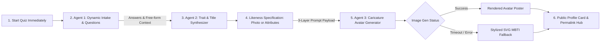

# Product Requirements Document (PRD)

## 1. Executive Summary & Product Vision
- **Project Name**: Hyper-Personalized Personality & Caricature Avatar Generator *(Working Title)*
- **Core Vision**: An internet-native, multi-agentic entertainment & self-discovery web application. Going far beyond traditional static 4-letter MBTI tests, it combines adaptive AI questioning with dynamic personality trait synthesis, unhinged/expressive custom titles (e.g., *Captain*, *Low-Key Legend*, *Chaos Orchestrator*), and AI-generated caricaturized avatars blending MBTI baseline character archetypes, specialized traits, and user likeness.

---

## 2. Product Strategy, Virality & Monetization

### 2.1 Short-Term Strategy (MVP & Growth Baseline)
- **Primary Goal**: Rapid viral adoption ($K\text{-factor} > 1.2$) and high completion rates ($> 85\%$).
- **Friction-Free CUJ Funnel**: Quiz starts immediately with zero upfront barrier. Likeness collection occurs *after* quiz completion to maximize completion rate.
- **Virality Hooks (Built into MVP)**:
  - **Public Permalinks (`/result/[sessionId]`)**: Unique URL created for every completed session, allowing friends and social visitors to view shared results without requiring local browser state.
  - **Story-Ready $9:16$ Share Poster**: Instant creation of aesthetic vertical cards for Instagram/TikTok stories, featuring the caricaturized avatar, top title, and badge highlights.
  - **Dynamic OpenGraph (OG) Links**: Server-rendered preview cards for links posted on iMessage, Twitter/X, and WhatsApp.
  - **Watermarked Free Avatars & Direct Referral Links**: Native web share triggers pointing back to the test with custom referral parameters.
- **Mocked/Early Monetization Hooks**:
  - UI placeholders for "HD Watermark Removal", "Avatar Style Packs", and "Deep Compatibility Check".

### 2.2 Long-Term Strategy & Roadmap
- **Monetization Models**:
  - **Freemium Tier**: Free quiz, top-level title, standard 3-trait summary, and standard resolution caricaturized avatar (watermarked).
  - **Premium Unlock / Micro-Transactions**:
    - **HD / Vector Avatar Downloads & Re-Roll Packs** ($1.99 - $4.99).
    - **Deep-Dive Psychological & Relationship Analysis**: Comprehensive multi-page report detailing behavioral dynamics, stress triggers, and workplace compatibility.
    - **Custom Style Themes**: Anime, Cyberpunk, Fantasy, Renaissance caricature themes.
  - **Social / Multi-User Compatibility**: Paid friend or group compatibility matrix reports.
  - **Merchandise Integration**: One-click printing of caricaturized avatars onto mugs, stickers, or T-shirts via print-on-demand APIs.

---

## 3. Core Assessment Framework & Multi-Agent Architecture

### 3.1 Agent 1: Dynamic Question Intake Engine
- **Scope**: Evaluates holistic behavioral dimensions (Self, Emotion, Attitude, Action, Social) anchored on MBTI/Big-Five principles.
- **Question Bounds**:
  - 28 situational questions covering $E/I$, $S/N$, $T/F$, and $J/P$ dichotomies.
  - Dynamic sequence (or quick 8–12 question subset for high-speed MVP mode).
- **Input Options & Guardrails**:
  - Option 1 (Choice A), Option 2 (Choice B), + optional free-form text context (max 280 chars).
  - Moderation layer strips prompt injection and profanity.

### 3.2 Agent 2: Personality & Archetype Synthesizer
- **Deterministic Baseline**: Computes core MBTI anchor score (`calculate_mbti_type`) using standard dichotomy matrix logic.
- **Generative Synthesis**: Agent 2 takes the 4-letter baseline anchor (`ENTJ`, `ENFP`, `INTP`) + free-form text input to generate:
  - **Dynamic Title**: Expressive, unhinged title (e.g., *Main Character*, *Overthinking Wizard*, *Low-Key Legend*).
  - **Prominent Top Traits**: 3-4 behavioral badge highlights.
  - **Deep Analysis Breakdown**: 5-model dimensional breakdown, radar graph data, strengths/flaws, and roasted commentary.

### 3.3 Agent 3 & Avatar Personalization Step (Post-Quiz)
- **CUJ Placement**: Likeness specification happens **after quiz completion**, right before generating the final avatar.
- **Likeness Capture Methods**:
  - **Option A (Photo Upload)**: Selfie/photo for facial feature extraction and image-to-image/ControlNet reference.
  - **Option B (Manual Likeness Picker)**: UI selectors for skin tone, hair color/style/length, gender expression, accessories.
- **3-Layer Composition Stack**:
  1. **Layer 1 (MBTI Base)**: Visual character template mapped from baseline score (`ENTJ` $\rightarrow$ Commander, `ENFP` $\rightarrow$ Campaigner).
  2. **Layer 2 (Trait & Title Modifiers)**: Outfits, props, and scene elements derived from Agent 2's unhinged title.
  3. **Layer 3 (User Likeness)**: Physical attributes collected in the post-quiz personalization step.
- **Resilience Circuit Breaker**: 10-second timeout, falling back to stylized SVG vector avatar if image API times out.

---

## 4. Feature Specifications

### 4.1 Landing Page (`/`)
- Hero section with viral tagline, dynamic preview gallery of caricatured avatars, and "Start Test" CTA (instant start).
- Privacy & entertainment disclaimer.

### 4.2 Interactive Test Flow (`/test`)
- **Step 1 — Quiz Questions (Immediate Start)**: Pagination with progress bar, step transitions, back button, and client-side state persistence (`localStorage`). Dual choices + optional free-form text.
- **Step 2 — Avatar Personalization (Post-Quiz)**: Occurs after final question is answered. Choice between Photo Upload or Manual Attribute Selectors (skin color, hair color/style/length, gender expression, accessories).
- **Step 3 — Agent 3 Avatar Generation**: Interactive progress loader displaying live synthesis updates.

### 4.3 Results & Archetype Hub (`/result/[sessionId]`)
- Server-rendered public permalink.
- Main view displaying MBTI baseline anchor, unhinged custom title, caricaturized avatar poster, 3-4 trait badges, and $9:16$ story poster exporter.

---

## 5. Non-Functional Requirements
- **Performance**: Quiz step transition < 200ms; Deterministic MBTI calculation < 1ms; LLM synthesis < 3s; Avatar generation < 10s.
- **State Persistence**: Client state synced to backend database for public permalinks (`/result/[sessionId]`).
- **Privacy & Safety**: Client photos stored transiently and processed securely. Manual attribute picking available for 100% photo-free privacy. Input sanitization prevents prompt injection.
