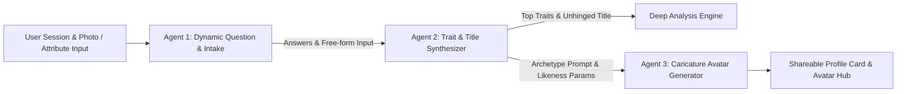

# Product Requirements Document (PRD)

## 1. Executive Summary & Product Vision
- **Project Name**: Hyper-Personalized Personality & Caricature Avatar Generator *(Working Title)*
- **Core Vision**: An internet-native, multi-agentic entertainment & self-discovery web application. Going far beyond traditional static 4-letter MBTI tests, it combines adaptive AI questioning with dynamic personality trait synthesis, unhinged/expressive custom titles (e.g., *Captain*, *Low-Key Legend*, *Chaos Orchestrator*), and AI-generated caricaturized avatars blending the user's likeness with their personality archetype.

---

## 2. Product Strategy, Virality & Monetization

### 2.1 Short-Term Strategy (MVP & Growth Baseline)
- **Primary Goal**: Rapid viral adoption ($K\text{-factor} > 1.2$) and high completion rates ($> 85\%$).
- **Virality Hooks (Built into MVP)**:
  - **Story-Ready $9:16$ Share Poster**: Instant creation of aesthetic vertical cards for Instagram/TikTok stories, featuring the caricaturized avatar, top title, and badge highlights.
  - **Dynamic OpenGraph (OG) Links**: Generated preview cards when sharing links on iMessage, Twitter/X, and WhatsApp.
  - **Watermarked Free Avatars & Direct Referral Links**: Native web share triggers pointing back to the test with custom referral parameters.
- **Mocked/Early Monetization Hooks**:
  - UI placeholders for "HD Watermark Removal", "Avatar Style Packs", and "Deep Compatibility Check".

### 2.2 Long-Term Strategy & Roadmap
- **Monetization Models**:
  - **Freemium Tier**: Free quiz, top-level title, standard 3-trait summary, and standard resolution caricaturized avatar (watermarked).
  - **Premium Unlock / Micro-Transactions**:
    - **HD / Vector Avatar Downloads & Re-Roll Packs** ($1.99 - $4.99).
    - **Deep-Dive Psychological & Relationship Analysis**: Comprehensive multi-page report detailing behavioral dynamics, stress triggers, and workplace compatibility.
    - **Custom Style Themes**: Anime, Cyberpunk, Fantasy, Renaissance caricature themes.
  - **Social / Multi-User Compatibility**: Paid friend or group compatibility matrix reports.
  - **Merchandise Integration**: One-click printing of caricaturized avatars onto mugs, stickers, or T-shirts via print-on-demand APIs.

---

## 3. Core Assessment Framework & Multi-Agent Architecture

### 3.1 Agent 1: Dynamic Question Intake Engine
- **Scope**: Evaluates holistic behavioral dimensions (Self, Emotion, Attitude, Action, Social) anchored on MBTI/Big-Five principles.
- **Mechanism**:
  - Tailors subsequent questions dynamically based on prior choices.
  - Supports structured **Multiple-Choice** options with an optional **Free-Form Input field** for custom user responses.

### 3.2 Agent 2: Personality & Archetype Synthesizer
- **Scope**: Evaluates raw multiple-choice + free-form answers.
- **Mechanism**:
  - **Dynamic Title Generation**: Generates contextual, expressive titles dynamically (e.g., *Main Character*, *Overthinking Wizard*, *Low-Key Legend*).
  - **Prominent Top Traits**: Highlights 3-4 dominant behavioral badges on the main result card.
  - **Deep-Dive Analysis Module**: Accessible via expandable view — includes dimensional breakdown (5-model matrix), radar chart values, Strengths/Flaws, and "Appearance vs. Reality" roasted commentary.

### 3.3 Agent 3: Caricaturized Avatar Generation
- **Scope**: Combines user likeness specification with synthesized archetype themes.
- **Multi-Modal Likeness Capture Mechanism**:
  - **Option A (Photo Upload)**: User uploads a selfie/photo for direct facial feature extraction and image-to-image/ControlNet reference.
  - **Option B (Manual Likeness Picker / Fallback)**: For privacy-conscious or camera-shy users, allow specifying physical attributes via UI selectors:
    - **Skin Tone / Complexion**
    - **Hair Color, Style & Length** (e.g. curly long brown hair, bald, short blonde crop)
    - **Gender / Expression Presentation**
    - **Accessories / Facial Features** (glasses, beard, hat, etc.)
- **Generation Output**:
  - Cost-effective, fast MVP image generation backend abstraction (e.g. Replicate / Fal.ai / FLUX / SDXL).
  - Generates caricaturized imagery (e.g., *Captain* title yields pirate captain directing a crew with user's specified facial/attribute likeness).
  - Supports avatar re-roll requests.

---

## 4. Feature Specifications

### 4.1 Landing Page (`/`)
- Hero section with viral tagline, dynamic preview gallery of caricatured avatars, and "Start Test" CTA.
- Privacy & entertainment disclaimer.

### 4.2 Interactive Test Flow (`/test`)
- Pagination with progress bar, step transitions, back button, and client-side state persistence (`localStorage`) to prevent progress loss on refresh.
- Adaptive question cards with choices + free-form text input option.
- **Likeness Specification Step**: Choice between photo upload or manual attribute selector (skin color, hair color/style/length, gender expression, accessories).

### 4.3 Results & Archetype Hub (`/result`)
- **Main View**: Top-level Title, Caricaturized Avatar Poster, 3-4 Prominent Trait Badges, and One-Click Social Share CTA ($9:16$ Story Card).
- **Deep Analysis View**: Expandable radar graph, strengths/flaws, cross-MBTI mapping, and roasted personality summary.

---

## 5. Non-Functional Requirements
- **Performance**: Quiz transitions < 200ms; Agent synthesis < 3s; Avatar generation < 10s with interactive loader.
- **State Persistence**: User progress saved continuously in browser state.
- **Privacy & Safety**: Client photos stored transiently and processed securely. Manual attribute picking available for 100% photo-free privacy.
