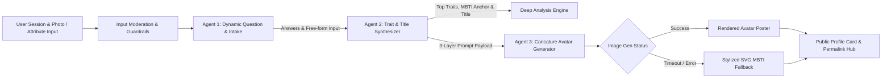

# Product Requirements Document (PRD)

## 1. Executive Summary & Product Vision
- **Project Name**: Hyper-Personalized Personality & Caricature Avatar Generator *(Working Title)*
- **Core Vision**: An internet-native, multi-agentic entertainment & self-discovery web application. Going far beyond traditional static 4-letter MBTI tests, it combines adaptive AI questioning with dynamic personality trait synthesis, unhinged/expressive custom titles (e.g., *Captain*, *Low-Key Legend*, *Chaos Orchestrator*), and AI-generated caricaturized avatars blending MBTI baseline character archetypes, specialized traits, and user likeness.

---

## 2. Product Strategy, Virality & Monetization

### 2.1 Short-Term Strategy (MVP & Growth Baseline)
- **Primary Goal**: Rapid viral adoption ($K\text{-factor} > 1.2$) and high completion rates ($> 85\%$).
- **Virality Hooks (Built into MVP)**:
  - **Public Permalinks (`/result/[sessionId]`)**: Unique URL created for every completed session, allowing friends and social visitors to view shared results without requiring local browser state.
  - **Story-Ready $9:16$ Share Poster**: Instant creation of aesthetic vertical cards for Instagram/TikTok stories, featuring the caricaturized avatar, top title, and badge highlights.
  - **Dynamic OpenGraph (OG) Links**: Server-rendered preview cards for links posted on iMessage, Twitter/X, and WhatsApp.
  - **Watermarked Free Avatars & Direct Referral Links**: Native web share triggers pointing back to the test with custom referral parameters.
- **Mocked/Early Monetization Hooks**:
  - UI placeholders for "HD Watermark Removal", "Avatar Style Packs", and "Deep Compatibility Check".

### 2.2 Long-Term Strategy & Roadmap
- **Monetization Models**:
  - **Freemium Tier**: Free quiz, top-level title, standard 3-trait summary, and standard resolution caricaturized avatar (watermarked).
  - **Premium Unlock / Micro-Transactions**:
    - **HD / Vector Avatar Downloads & Re-Roll Packs** ($1.99 - $4.99).
    - **Deep-Dive Psychological & Relationship Analysis**: Comprehensive multi-page report detailing behavioral dynamics, stress triggers, and workplace compatibility.
    - **Custom Style Themes**: Anime, Cyberpunk, Fantasy, Renaissance caricature themes.
  - **Social / Multi-User Compatibility**: Paid friend or group compatibility matrix reports.
  - **Merchandise Integration**: One-click printing of caricaturized avatars onto mugs, stickers, or T-shirts via print-on-demand APIs.

---

## 3. Core Assessment Framework & Multi-Agent Architecture

### 3.1 Agent 1: Dynamic Question Intake Engine
- **Scope**: Evaluates holistic behavioral dimensions (Self, Emotion, Attitude, Action, Social) anchored on MBTI/Big-Five principles.
- **Question Bounds & Termination Matrix**:
  - **Hard Limits**: Minimum **8 questions**, Maximum **12 questions**.
  - **Early Stop Rule**: Session terminates early (at Q8–Q10) if trait confidence matrix achieves $> 85\%$ variance separation.
- **Input Types & Moderation Guardrails**:
  - Multiple-choice options + optional free-form text input (max 280 characters).
  - **Moderation Layer**: Input sanitization strips prompt injection patterns and profane content. Toxic free-form inputs gracefully default to closest multiple-choice fallback option.

### 3.2 Agent 2: Personality & Archetype Synthesizer
- **Scope**: Evaluates raw multiple-choice + free-form answers.
- **Mechanism**:
  - **MBTI Baseline Anchor**: Maps user responses to a core MBTI character archetype foundation (e.g. Commander, Campaigner, Architect, Debater).
  - **Dynamic Title Generation**: Generates contextual, expressive titles dynamically (e.g., *Main Character*, *Overthinking Wizard*, *Low-Key Legend*).
  - **Prominent Top Traits**: Highlights 3-4 dominant behavioral badges on the main result card.
  - **Deep-Dive Analysis Module**: Accessible via expandable view — includes dimensional breakdown (5-model matrix), radar chart values, Strengths/Flaws, and "Appearance vs. Reality" roasted commentary.

### 3.3 Agent 3: Caricaturized Avatar Generation
- **Scope**: Generates visual avatars built on a 3-layer composition stack:
  1. **Layer 1 (MBTI Character Foundation)**: Core visual style of the baseline MBTI archetype character (e.g., *16personalities-inspired Commander/Architect/Campaigner character template*).
  2. **Layer 2 (Specialized Trait & Title Overlay)**: Modifies outfits, props, and background elements derived from Agent 2's unhinged traits and custom title (e.g., pirate captain hat/ship deck superimposed on a Commander base).
  3. **Layer 3 (User Likeness Fusion)**: Physical attributes (from selfie photo OR manual skin tone/hair color & length/gender/accessory selectors).
- **Prompt Conflict Hierarchy**: Physical user likeness overrides conflicting trait props (e.g. specified bald hair overrides wig overlays).
- **Resilience & Fallback Mechanism**:
  - Image generation timeout capped at **10 seconds**.
  - **Graceful Fallback**: If external image API fails or times out, the system automatically renders a high-quality stylized SVG vector avatar derived from the MBTI baseline character.
  - **Interactive Loader**: Displays live progressive agent status messages during processing (e.g. *"Agent 1 analyzed traits..."* $\rightarrow$ *"Agent 2 assigned 'Captain' title..."* $\rightarrow$ *"Agent 3 rendering avatar..."*).

---

## 4. Feature Specifications

### 4.1 Landing Page (`/`)
- Hero section with viral tagline, dynamic preview gallery of caricatured avatars, and "Start Test" CTA.
- Privacy & entertainment disclaimer.

### 4.2 Interactive Test Flow (`/test`)
- Pagination with progress bar, step transitions, back button, and client-side state persistence (`localStorage`) to prevent progress loss on refresh.
- Adaptive question cards with choices + free-form text input option (8–12 questions).
- **Likeness Specification Step**: Choice between photo upload or manual attribute selector (skin color, hair color/style/length, gender expression, accessories).

### 4.3 Results & Archetype Hub (`/result/[sessionId]`)
- **Public Permalinks**: Fully server-rendered permalinks allowing direct social sharing.
- **Main View**: Top-level Title, Caricaturized Avatar Poster (MBTI Base + Custom Trait Layer + User Likeness), 3-4 Prominent Trait Badges, and One-Click Social Share CTA ($9:16$ Story Card).
- **Deep Analysis View**: Expandable radar graph, strengths/flaws, cross-MBTI mapping, and roasted personality summary.

---

## 5. Non-Functional Requirements
- **Performance**: Quiz transitions < 200ms; Agent synthesis < 3s; Avatar generation < 10s with interactive loader; SVG fallback trigger at 10.1s.
- **State Persistence**: Client state synced to backend database for public permalinks (`/result/[sessionId]`).
- **Privacy & Safety**: Client photos stored transiently and processed securely. Manual attribute picking available for 100% photo-free privacy. Input sanitization prevents prompt injection attacks.
