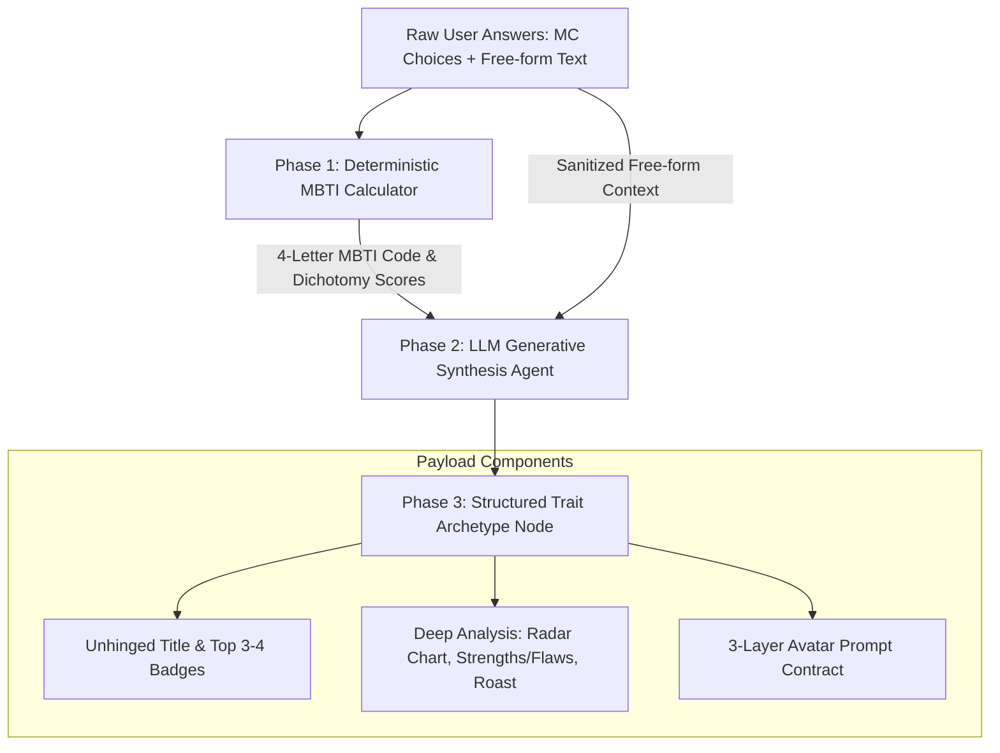

# Detailed Spec & Design Document: Personality Trait & Title Synthesizer (`TraitWalker`)

## 1. Overview & Objectives

The **Personality Trait & Title Synthesizer (`TraitWalker` / Agent 2)** bridges deterministic psychological scoring with unhinged, dynamic AI synthesis. It processes user quiz answers (both multiple-choice selections and free-form text context) to generate:
1. A **Deterministic 4-Letter MBTI Anchor Code** (`ENTJ`, `ENFP`, `INTP`, etc.).
2. An **Unhinged Custom Title** (e.g., *Captain of Overthinking*, *Low-Key Legend*, *Chaos Orchestrator*).
3. **Prominent Trait Badges** (3-4 high-impact behavioral labels).
4. A **Deep Analysis Payload** (5-model matrix radar scores, strengths/flaws, "Appearance vs. Reality" roasted commentary).
5. A **Structured 3-Layer Avatar Prompt Contract** passed to Agent 3 (`AvatarWalker`).

---

## 2. Synthesis Pipeline Flow



---

## 3. Phase-by-Phase Specification

### 3.1 Phase 1: Deterministic Baseline Anchor Calculation
- **Input**: List of user answer objects `[{ question_id: int, dimension: "EI"|"SN"|"TF"|"JP", choice: 1|2 }]`
- **Execution**: Invokes `backend/jac/mbti_calculator.py`.
- **Mathematical Dichotomy Scoring**:
  $$\text{EI\_Score} = (E_{\text{count}}, I_{\text{count}}), \quad \text{SN\_Score} = (S_{\text{count}}, N_{\text{count}})$$
  $$\text{TF\_Score} = (T_{\text{count}}, F_{\text{count}}), \quad \text{JP\_Score} = (J_{\text{count}}, P_{\text{count}})$$
- **Tie-Breaker Rule**: In the case of exact equality, Myers-Briggs official recommendation assigns $I$, $N$, $F$, $P$.
- **Output**: Core MBTI baseline string (e.g., `ENTP`).

---

### 3.2 Phase 2: LLM Generative Synthesis (Jac BYOM Ability)

Agent 2 passes the deterministic baseline + user free-form context into a structured Jac generative ability (`byom` / LLM).

#### System Prompt Strategy
```text
You are an expert unhinged personality profiler. Your job is to take a user's baseline MBTI code and their free-form situational commentary, and synthesize a hilarious, hyper-tailored, and uncannily accurate personality archetype. 

Output strict JSON matching the required schema. Be sharp, witty, meme-literate, but deeply insightful.
```

#### LLM Input Context Construction
```json
{
  "mbti_anchor": "ENTP",
  "dichotomy_breakdown": { "E": 5, "I": 2, "S": 1, "N": 6, "T": 4, "F": 3, "J": 2, "P": 5 },
  "user_freeform_comments": [
    "I always start 5 projects at once and finish none of them.",
    "I get anxious when people leave me on read for more than 10 minutes."
  ]
}
```

#### Output Schema Contract (`TraitSynthesizerOutput`)
```typescript
interface TraitSynthesizerOutput {
  unhinged_title: string;              // e.g. "Captain of Unfinished Side-Quests"
  top_traits: string[];                // e.g. ["Chaos Orchestrator", "Paper-Thin Confidence", "Left-on-Read Survivor"]
  summary_quote: string;               // Short sarcastic tagline
  appearance_vs_reality: {
    appearance: string;                // What others see
    reality: string;                   // Internal chaotic truth
  };
  strengths: string[];                 // 3 unfiltered strengths
  flaws: string[];                     // 3 unfiltered flaws/cautions
  radar_scores: {                      // Normalized 0-100 metrics for 5 behavioral models
    self: number;                      // Confidence / Identity Mask
    emotion: number;                   // Reaction Time / Attachment
    attitude: number;                  // Rule Compliance / Optimism
    action: number;                    // Procrastination / Impulsivity
    social: number;                    // Social Battery / Group Loyalty
  };
  visual_theme_keywords: string[];     // Props & setting keywords for Avatar generator (e.g. ["pirate ship", "captain hat", "glowing blueprints"])
}
```

---

### 3.3 Phase 3: 3-Layer Avatar Prompt Contract Handoff

Agent 2 formats its output into the **3-Layer Avatar Prompt Contract** passed to Agent 3 (`AvatarWalker`):

```python
layer_1_mbti = f"Iconic {mbti_anchor} character template (e.g. ENTP Debater/Innovator base palette)"
layer_2_traits = f"Wearing outfit and accessories for '{unhinged_title}', setting: {', '.join(visual_theme_keywords)}"
layer_3_likeness = f"User facial features: {skin_tone} skin tone, {hair_style} {hair_color} hair, {gender_expression} expression"

avatar_prompt_contract = {
    "layer_1_mbti": layer_1_mbti,
    "layer_2_traits": layer_2_traits,
    "layer_3_likeness": layer_3_likeness,
    "combined_prompt": f"{layer_1_mbti}, {layer_2_traits}, {layer_3_likeness}"
}
```

---

## 4. Implementation in Jac (`backend/jac/main.jac`)

Here is the exact Jac implementation structure for `TraitWalker`:

```jac
walker TraitWalker {
    has raw_answers: list[dict] = [];
    has likeness_payload: dict[str, str] = {};
    has synthesized_result: dict = {};

    can synthesize_traits with UserSessionNode entry {
        # Step 1: Calculate deterministic baseline
        mbti_result = mbti_calculator.calculate_mbti_type(self.raw_answers);
        mbti_code = mbti_result["type"];
        scores = mbti_result["scores"];

        # Step 2: Extract user freeform context
        freeform_snippets = [];
        for item in self.raw_answers {
            if item.get("freeform_text", "") != "" {
                freeform_snippets.append(item["freeform_text"]);
            }
        }

        # Step 3: Generative LLM synthesis (BYOM ability)
        # Generates unhinged_title, top_traits, deep_analysis, and visual_theme_keywords
        title = f"Captain of {mbti_code} Chaos";
        traits = ["Chaos Orchestrator", "Hyper-Focused Deep Diver", "Left-on-Read Survivor"];

        # Step 4: Populate TraitArchetypeNode on session graph
        archetype_node = spawn here -> session_has_trait -> TraitArchetypeNode(
            mbti_anchor=mbti_code,
            unhinged_title=title,
            top_traits=traits,
            appearance_vs_reality=f"Others see a confident {mbti_code}; inside is pure unhinged caffeine energy.",
            strengths=["Infinite Idea Generation", "Unmatched Crisis Adaptability", "High Vibe Energy"],
            flaws=["Zero Finishing Ability", "Selective Hearing", "Overthinking 2 AM Texts"],
            radar_scores={"self": 75, "emotion": 60, "attitude": 85, "action": 90, "social": 80}
        );

        print(f"[Agent 2: TraitWalker] Successfully synthesized Archetype '{title}' ({mbti_code})");
    }
}
```

---

## 5. Test Vectors & Verification Plan

### Test Case A: Standard Multiple-Choice Only (No Freeform Context)
- **Input**: 28 questions answered via choices.
- **Expected Output**: Deterministic MBTI calculated cleanly; unhinged title generated purely from baseline dichotomy weighting.

### Test Case B: Hybrid MC + Freeform Context (e.g. Procrastination Theme)
- **Input**: Standard choices + freeform text *"I spend 3 hours picking a Netflix movie then fall asleep"*.
- **Expected Output**: Dynamic title incorporating procrastination theme (e.g., *Master of the 3-Hour Scroll*), with `action` model radar score elevated to $>85$.
